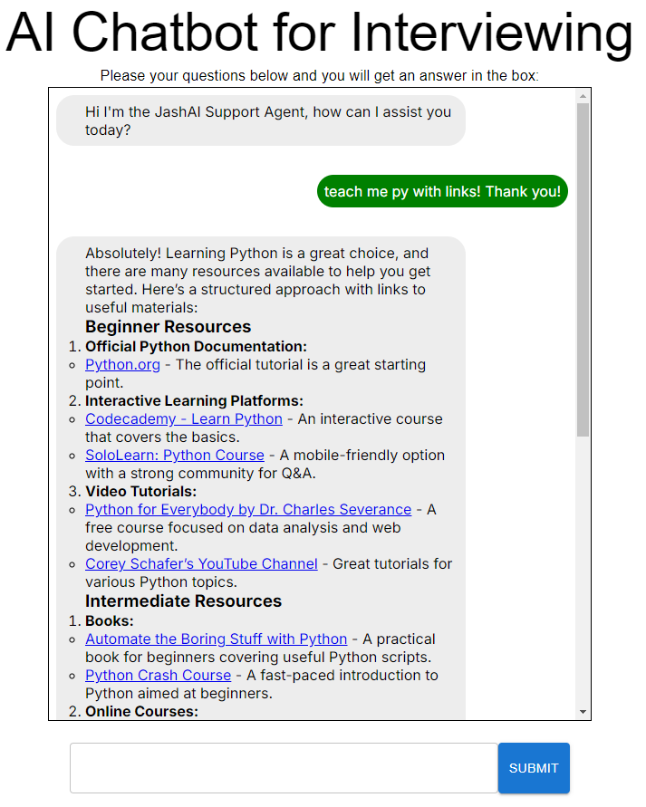

# Jashish's AI Chatbot for SWE interviewing help
Project dedicated to learning integrations with AI models and using Node.JS, Open AI, and few other stacks.

## Current features
- Acts as a bot to help you prepare for SWE interviews
- Keeps history as long as page isnt refreshed
- Screen is fixed size so that the scroll will only happen within the chat window
- The output will be in markdown, does have issues with code blocks with long lines since they dont wrap
- Uses the cheapest Open AI model - gpt-4o-mini

## Images for reference

## Other Talking points
- For the markdownb format tried a two packages and researched other ways just within Material UI but wasnt successful
  - Ended up using [react-markdown](https://github.com/remarkjs/react-markdown)
    - This worked right out of the box bullet and number points still have issues which is why the Response for the AI are padded
  - Tried [mui-markdown](https://dev.to/hpouyanmehr/markdown-with-mui-formerly-material-ui-components-13n2)
    - This had a few font issues and formatting inconsistencies 

## Running locally
Steps to run this locally:
1. Check if you have Node.js by running  "node -version" in your terminal
2. Run "npm install" when the terminal is opened within this project/directory (/chatbot-using-ai)
3. Create a ".env.local" file in the cloned directory 
4. Within the ".env.local" file you will have to add your own API Key like this "OPENAI_API_KEY=abcd", which you can get from their website and it will need a balance of non zero. 
5. Run "npm run dev" and hope you have fun